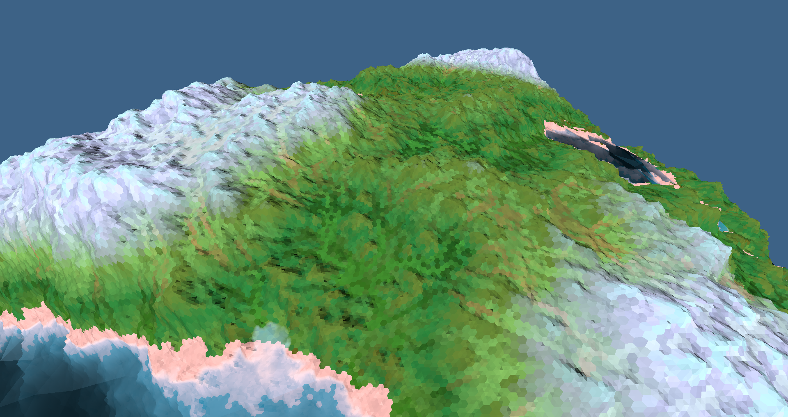

# Sphere Terrain
Terrain generation and erosion simulation on a sphere.

This project implements [this bachelor's thesis](https://www.firespark.de/resources/downloads/implementation%20of%20a%20methode%20for%20hydraulic%20erosion.pdf)
to work on an icosphere's surface using the points on the icosphere as the nodes in lieu of a grid.

This project:
- Is based on [`hexasphere`](https://crates.io/crates/hexasphere).
- Features wetness and river simulations to construct biomes.
- Takes some liberties in implementing the thesis to make it work with a sphere.
- Is parallelized by rayon.
- Is nightly only, since I use [Ralith's excellent `clatter`](https://github.com/Ralith/clatter).
- Will be updated as I use it or as feature requests come in.

Documentation is light, however I am always happy to discuss how to use the library, feel free to message me or open an issue asking questions.

## Demo video:

https://www.youtube.com/watch?v=fiZU8aLEin8

The project featured in this video is a separate (currently) private project which I intend to develop into a game.

This library does _not_ do rendering, and mesh generation from the structures it provides is up to you.
